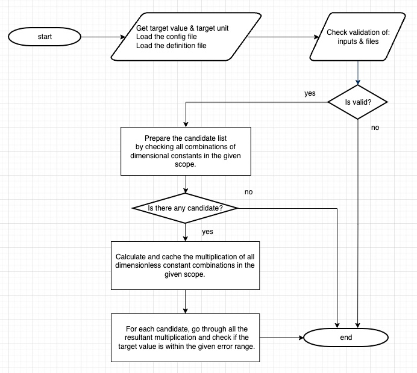

# Physics Constants Explorer

This work contains a python program to explore physical constants in terms of given dimensional and dimensionless constants. 

The exploration of some well-known physical constants by using this program is summarized under [research](research) folder.

## Table of Content

<!-- TOC -->
* [1 Motivation & Concept](#1-motivation--concept)
* [2 Methodology](#2-methodology)
* [3 Python Installation](#3-python-installation)
* [4 The Program Usage](#4-the-program-usage)
  * [4.1 Running The Program](#41-running-the-program)
  * [4.2 The Definition File](#42-the-definition-file)
  * [4.3 The Config File](#43-the-config-file)
* [5 The Program Outputs](#5-the-program-outputs)
* [6 Tests](#6-tests)
* [7 Researches](#7-researches)
* [8 Resources & Libraries](#8-resources--libraries)
* [9 Future Work](#9-future-work)
<!-- TOC -->

## 1 Motivation & Concept

Most of the relations in physics are observed from experiments and constants in the relations measured by instruments within the given error range.

For example Stefan-Boltzmann Constant, [Josef Stefan](https://en.wikipedia.org/wiki/Josef_Stefan) had found the relation between radiation power and temperature of the black body radiation problem:

```math
j^{\star} = \sigma T^{4}
```

where,

* $j^{\star}$ is radiated power per unit area
* $T^{4}$ is 4th power of radiated material's temperature
* $\sigma$ is a __physical constant__ (known as Stefan–Boltzmann constant)

Theoretical formulation of $\sigma$ was done by [Ludwig Eduard Boltzmann](https://en.wikipedia.org/wiki/Ludwig_Boltzmann):

```math
\sigma ={\frac {2\pi ^{5}k^{4}}{15c^{2}h^{3}}} \approxeq 5.670374\times 10^{-8}\,\mathrm{kg}\cdot\mathrm{s}^{-3}\cdot\mathrm{K}^{-4}
```

where

* $k$ is the [Boltzmann constant](https://en.wikipedia.org/wiki/Boltzmann_constant) (physical constant)
* $h$ is the [Planck constant](https://en.wikipedia.org/wiki/Planck_constant) (physical constant)
* $c$ is the [Speed of Light](https://en.wikipedia.org/wiki/Speed_of_light) in vacuum (physical constant)
* $\pi$ is the ratio of a circle's circumference to its diameter (mathematical constant)

with SI base units:

* kg is kilogram
* s is second
* K is Kelvin

Formulation of $\sigma$ was [theoretically derived](https://edisciplinas.usp.br/pluginfile.php/48089/course/section/16461/qsp_chapter10-plank.pdf) by using the other physical and mathematical constants.

---

Let's think oppositely and assume we have a function which takes:

* A target value ( $5.670374\times 10^{-8}$ )
* A target unit ( $\mathrm{kg}\cdot\mathrm{s}^{-3}\cdot\mathrm{K}^{-4}$ )
* As a scope, list of dimensional physical constants ( $k$, $h$, $c$, ...)
* As a scope, list of dimensionless constants ( $\pi$, 2, 3, 5, ...)

and returns set of multiplication results, so that:

* The unit of the target is "exactly" matched with the unit of results and,
* The numeric value of the target overlaps with the numeric values of the results.

Example Output:

```text
{ 5.6703744191844... e-8 (exact) } [ kg/K⁴/s³ ] = 2⋅π⁵⋅k⁴ / (3⋅5⋅c²⋅ℎ³)
```

Would it be possible and "useful"?

Yes, it is possible. The program explained here outputs the all calculation steps in detail. 
So, even exploring the dimensionally matched candidates may be useful for the experts in their research.

And the methodology can be expanded to a wider scope with distributed calculation methodologies.

## 2 Methodology

It is a well-known fact that the resultant unit on the right side of the equations must match the left side.

We can represent physical quantities Q1 and Q2 with their absolute errors:
```text
Quantity = {numeric value ± error} ⋅ [unit]

Q1 = {Q1 ± ΔQ1}⋅[Q1]
Q2 = {Q2 ± ΔQ2}⋅[Q2]
```

If Q1 = Q2 then the following conditions must be fulfilled: 
* Unit match: [Q1] = [Q2], and
* Their numeric values must also overlap:
  * Q1 + ΔQ1 >= Q2 - ΔQ2, and
  * Q1 - ΔQ1 <= Q2 + ΔQ2

Numeric value overlapping condition can be expressed by using their [relative errors](https://de.wikipedia.org/wiki/Fehlerschranke):
* 1 + δQ1 + δQ2 >= Q1/Q2, and
* 1 - δQ1 - δQ2 <= Q1/Q2

Where relative errors, δQ1 = ΔQ1 / Q1 and δQ2 = ΔQ2 / Q2.

__Note__: For physical constants, even if units are matched and quantities' numeric values are overlapped, we can not state directly the formulation of Q1 is equal to the Q2 expression! 

In the program, we have `T` as the target physical quantity and the program investigate set of candidate quantities satisfying the matching conditions given above!

The program also takes a config file ([default_config.json](src/resources/default_config.json)) to restrict it scope and a definition file ([default_definition.json](src/resources/default_definition.json)) which contains the definition of dimensional and dimensionless quantities.

The main calculation steps can be summarized as:



The simple and clear set of methodologies were applied:

1. Brute force algorithm for all multiplication combinations
2. Using a unit library ([pint](https://pint.readthedocs.io/en/stable/)) to:
   * Represent dimensional constants units in SI base units
   * Correctly calculate and compare the units of multiplication and power operations
3. Using scientific notation with the ["concise form"](https://en.wikipedia.org/wiki/Scientific_notation#Estimated_final_digits).
4. Calculating and using the relative errors.
5. Using [decimal](https://docs.python.org/3/library/decimal.html) library to represent numeric values of quantities with high significant digits.
6. Using [fractions](https://docs.python.org/3/library/fractions.html) library to represent the power of the quantities and its units.

### 2.1 Technical Problems & Solutions

Unfortunately, we cannot use the float type or Decimal library to calculate the powers of the units and compare the results with the target unit.

So,
* The "pint" library in conjunction with the Python's Fractions library was used to calculate the mathematical operations of the units part of the quantities.
* Python's Decimal library was used to calculate the mathematical operations of the numeric values of the quantities.

The main reasons about this technical decisions are:
1. With Python Fractions library, we can achieve units power multiplications correctly, such as:
   * $s^{2/3}$ ⋅ $s^{4/3}$ ≟ $s^{2}$
   * $s^{-1/6}$ ⋅ $s^{7/6}$ ≟ $s$
2. "pint" library has support for "Non integer types" (non_int_type) to set `Decimal` or `Fractions`. But, unfortunately I could not find a way to set numeric and unit class types differently.  
3. Decimal Library has nice set of features to represent numbers with high precision and operate on it quickly.

## 3 Python Installation

The implementation is done by using Python 3.9.13. The program should be run with Python >=3.9.13

If python is not installed, I suggest using one of "Python Version Manager" (Anaconda, pyenv, etc.)

After cloning this repository, to install the required libraries, the following shell codes can be executed line by line on the projects root folder:

```shell
> python -m venv ./venv
> source ./venv/bin/activate
> python -m pip install --upgrade pip
> pip install -r ./requirements.txt
```

## 4 The Program Usage

The program takes:
* The target quantity numeric value
* The target quantity unit
* The definition file, that is a list of all dimensional and dimensionless constant definitions in JSON format.
* The config file, that is the scope of the program in JSON format. It is a list of dimensional and dimensionless constants power ranges.

The program prints the results in descriptive format on the console.

### 4.1 Running The Program

The program `main.py` takes the following parameters:

* `--target-value` (mandatory)
* `--target-unit` (mandatory)
* `--config-file` (optional)
* `--definition-file` (optional)

As an example, the Rydberg constant can be explored: 

```shell
> python ./main.py --target-value "1.0973731568160(21)e+7" --target-unit "1/m"
```

Sample usages of the program can be accessible under the [research/script](research/script) folder.

#### 4.1.1 The Inputs 

The ` --help` option displays the inputs:

```shell
options:
  -h, --help            show this help message and exit
  -v, --target-value 
                        Target value with scientific notation.
                        To specify target value with the standard uncertainty please use "concise form".
                        For example to execute (1.23±0.06)×10^−5, enter "1.23(6)E-5" or "1.230(60)E-5".
                        Some valid examples: "1.23(6)E-5", "8.9875(15)E+16", "4.20(30)E+0"
                        The target value can also be provided without uncertainty specification:
                        In this cae, the program converts "1.23E-5" to "1.230(10)E-5"
                        Some valid examples: "1.23E-5", "8.9875E+16", "4.2E+0"
  -u, --target-unit 
                        Target unit expression in terms of SI base units symbols.
                        Length - meter (m)
                        Time - second (s)
                        Amount of substance - mole (mol)
                        Electric current - ampere (A)
                        Temperature - kelvin (K)
                        Luminous intensity - candela (cd)
                        Mass - kilogram (kg)
                        Use ^ symbol to represent power and space for multiplication.
                        Some valid examples: "kg/(s^3 K^4)", "kg s^-3 K^-4", "m/s"
  -c, --config-file 
                        Relative path of the config file.
                        It is a JSON file that contains the list of dimensional and dimensionless constants
                        with their power range. This file is validated by "src/resources/schema/config_schema.json"
                        If it is not provided the program uses the default config file, located:
                        ./src/resources/default_config.json
  -d, --definition-file 
                        Relative path of the definition file.
                        It is a JSON file that contains the definition of dimensional and dimensionless constants.
                        This file is validated by "src/resources/schema/definition_schema.json"
                        If it is not provided the program uses the default definition file, located:
                        ./src/resources/default_definition.json
```

### 4.2 The Definition File

All dimensional and dimensionless constants are defined under this JSON file. The program can load and consider only the constants defined in this file.

The program uses its [default definition file](src/resources/default_definition.json), if `--definition-file` parameter is not provided.

The definition file has 2 main collections:
* `dimensional_constants`
* `dimensionless_constants`

Each collection has its own `key`, `value` pairs, for example:
```json
{
  "dimensional_constants": {
    "speed_of_light_in_vacuum": {
      "numeric_value": "2.99792458e+8",
      "unit": "m/s",
      "symbol": "c"
    },
    ...
  },
  "dimensionless_constants": {
    "pi": {
      "numeric_value": "3.1415926535897932384626433832795028841971693993751",
      "symbol": "π"
    },
    ...
  }
}
```
#### 4.2.1 Dimensional Constants Collection

This collection should only contain constants that have unit.

It has the following key-value pair definitions:
* `key` values should contain a descriptive information (on the given example above it is `speed_of_light_in_vacuum`).
* `value` object has the following kay-value pairs:
  * `"numeric_value": "..."` (mandatory). 
    * The values should be in scientific notation format.
    * `"2.99792458e+8"`, if it is an exact value, then the relative error will be 0.
    * `"6.67430(15)e-11"`, if it has some measurement error. The format is a combination of both scientific and concise notations. The program considers this value as `(6.67430 ± 0.00015)✕10⁻¹¹`
  * `"unit": "..."` (mandatory). 
    * Only SI base units are allowed as units of dimensional constants which are: m, s, mol, A, K, cd, kg
    * The following characters can be used:
      * a single space for multiplication
      * `/` for divisions
      * `^` for powers
      * `(...)` parentheses for grouping
    * The following examples which gives the same resultant unit (for example the unit of "Vacuum magnetic permittivity constant"):
      * `A^2 s^4/kg/m^3` = `A^2 s^4/(kg m^3)` = `A^2 s^4 kg^-1 m^-3` 
  * `"symbol": "..."` (optional). 
    * The symbol is used on the results. If it is not provided the `key` value is used on the output of the program.
  * `"info": "..."` (optional). 
    * Can be set to describe the constant in more detail.

#### 4.2.2 Dimensionless Constants Collection

This collection should only contain constants that have no units.

It has the same key-value pairs with the same formats as the "Dimensional Constants Collection" except for `unit` definitions.

### 4.3 The Config File

The configuration file determines the scope of the program that will be used to find results.

In this file, the list of dimensional and dimensionless constants is given along with their power ranges.

The program uses its [default config file](src/resources/default_config.json), if `--config-file` parameter is not provided.

The default config file is prepared by exploring some physical constants. These explorations are located under [the research part](/research).

The config file has the following parameters:
* `dimensional_constants`
* `dimensionless_constants`
* `settings`

#### 4.3.1 The Power Ranges

Each `..._constants` collection has its own `key`, `value` pairs, for example:
```json
{
  "dimensional_constants": {
    "speed_of_light_in_vacuum": [-2, 6],
    "vacuum_magnetic_permeability": {"range": [0, 2], "step": "1/3"},
    ...
  },
  "dimensionless_constants": {
    "pi": 4,
    ...
  },
  ... 
}
```

The `key` values (for example `speed_of_light_in_vacuum`) should match the `key` values on the provided definition file. 

Besides this, exact custom numeric values (such as prime numbers) can be used under `dimensionless_constants` collection __without defining under the definition file__. For example:
```json
{
  ...
  "dimensionless_constants": {
    "2": 8,
    ...
  }
```

Power range values can be in 3 format as given the example above:
* List format: `[min, max]`
  * For example `[-2, 6]`, the program converts it as integer range e.g. [-2, 1, 0, 1, 2, 3, 4, 5, 6]. It adds `0`, if `0` does not exist in the range.
* Integer format: Z
  * The integer value must be greater than zero (Z > 0) 
  * The program converts it as a list format `[-Z, Z]`.
* Object format: `{"range": [min, max], "step": "s"}`
  * For this example `{"range": [0, 2], "step": "1/3"}` the program creates the power range as: [0, 1/3, 2/3, 1, 4/3, 5/3, 2]

If `0` is not given on the range (or in the converted ranges), the program adds `0` on the default. 

#### 4.3.2 The Settings

The `method` parameter under settings can be set one of these:
* "brute_force"
  * It is a pure brute force implementation
* "brute_force_with_memorization"
  * It contains memorization implementation by pre-calculating the "some" group of quantities. The performance is better than `brute_force`.
* "buckingham_pi"
  * If it is set, "[Buckingham π theorem](https://en.wikipedia.org/wiki/Buckingham_%CF%80_theorem)" implementation of pint library "[pi_theorem](https://pint.readthedocs.io/en/0.10.1/pitheorem.html)" is used.
  * It calculates all pi terms and calculates the all power combinations of found pi terms. So, the usage of this method requires the following settings:
```json
  "settings": {
    "method": "buckingham_pi",
    "buckingham_pi_ranges": [-2, 2]
  },
```
  * You can set power range settings as explained above.
  
## 5 The Program Outputs

The program prints the outputs to console. 

### 5.1 Store Results into a File

The outputs can be stored into a file as shown below:

```shell
> python ./main.py ...  > output_file_name.txt
```

It will store the results into `output_file_name.txt` file on the same folder that the script is executed.

### 5.2 Output Format

There are 3 sections on the output:
* Summarizing the Inputs
* Listing the Candidates
* Results

The following sections explain the parts of the `Rydberg constant` [exploration](research/output/derived_constants/rydberg_constant.txt) as an example.

#### 5.2.1 Summarizing the Inputs
```text
Explore the target:
	{ 1.0973731568160(21) e+7 } [ 1/m ] = Target
in terms of the given,
	dimensional constants:   
		c = { 2.99792458e+8 } [ m/s ], powers = [-2, -1, 0, 1, 2]
		ℎ = { 6.62607015e-34 } [ kg·m²/s ], powers = [-3, -2, -1, 0, 1, 2, 3]
		k = { 1.380649e-23 } [ kg·m²/K/s² ], powers = [-4, -3, -2, -1, 0, 1, 2, 3, 4]
		e = { 1.602176634e-19 } [ A·s ], powers = [-4, -3, -2, -1, 0, 1, 2, 3, 4]
		ε_0 = { 8.8541878128(13)e-12 } [ A²·s⁴/kg/m³ ], powers = [-2, -1, 0, 1, 2]
		m_e = { 9.1093837015(28)e-31 } [ kg ], powers = [-2, -1, 0, 1, 2]
		N_A = { 6.02214076e+23 } [ 1/mol ], powers = [-1, 0, 1]
	dimensionless constants: 
		2, powers = [-3, -2, -1, 0, 1, 2, 3]
		3, powers = [-1, 0, 1]
		5, powers = [-1, 0, 1]
		π, powers = [-5, -4, -3, -2, -1, 0, 1, 2, 3, 4, 5]
		wien_u, powers = [-1, 0, 1]
		μ, powers = [-1, 0, 1]
		g_e, powers = [-1, 0, 1]
		g_p, powers = [-1, 0, 1]
by using brute_force methodology...
```

#### 5.2.2 Listing the Candidates
After checking all combination of the dimensional constants given in the scope, 
the program prepares the candidates list whose resultant unit matches the target unit.

```text
Found 4 candidates the resultant unit matched with the target's unit:
	{ Q } [ 1/m ] = e⁴⋅m_e / (c⋅ℎ³⋅ε_0²)
	  ├── 👍 In range!
	  └── Min (~5E-3) < Q (~9E+7) < Max (~2E+16) 

	{ Q } [ 1/m ] = e²⋅m_e / (ℎ²⋅ε_0)
	  ├── 👍 In range!
	  └── Min (~5E-3) < Q (~6E+9) < Max (~2E+16) 

	{ Q } [ 1/m ] = c⋅m_e / ℎ
	  ├── 👍 In range!
	  └── Min (~5E-3) < Q (~4E+11) < Max (~2E+16) 

	{ Q } [ 1/m ] = c²⋅ε_0⋅m_e / e²
	  ├── 👍 In range!
	  └── Min (~5E-3) < Q (~3E+13) < Max (~2E+16) 
```

For example, if we look at the first candidate,
```text
...
	{ Q } [ 1/m ] = e⁴⋅m_e / (c⋅ℎ³⋅ε_0²)
	  ├── 👍 In range!
	  └── Min (~5E-3) < Q (~9E+7) < Max (~2E+16) 
...
```

The program calculated the quantity and represented its numerical value as `{ Q }` and its unit as `[ 1/m ]`.

`Min` and `Max` values are calculated as:

`Min (...)` = (Target value) / (The _maximum_ value of the whole dimensionless range)

`Max (...)` = (Target value) / (The _minimum_ value of the whole dimensionless range)

So, the line:

`	  └──  Min (~5E-3) < Q (~9E+7) < Max (~2E+16) `:

represents, `Q` as in the range of dimensionless range. 
If it is not in the range, this candidate will be ignored and its numerical value will not be investigated on the next steps.

This distinction is highlighted as `👍 In range!` or `👎 Not in range.`.

#### 5.2.3 Results

At this step, if there exist a candidate, the program calculates all dimensionless multiplication combinations given in the scope.
```text
Totally, unique 56133 dimensionless multiplications are calculated!
```
If we multiply the length of mathematical constants powers:
`56133 = 7 x 3 x 3 x 11 x 3 x 3 x 3 x 3` combination count can be verified.

At the end, the program lists numerically matched results from the candidate list:

```text
Result(s) that overlap with the target:
	{ 1.0973731568160(21) e+7 } [ 1/m ] = Target
	{ 1.09737315681(66) e+7 } [ 1/m ] = e⁴⋅m_e / (2³⋅c⋅ℎ³⋅ε_0²)

Where
* m_e: the electron mass
* c: the speed of light in vacuum
* ℎ: the planck constant
* e: the elementary charge
* ε_0: the vacuum electric permittivity
```

The program represents the resultant expression with its error values (`{ 1.09737315681(66) e+7 }`) in concise form.

If the resultant expression has no relative error, then it is displayed (for example in [Stefan-Boltzmann constant](research/output/derived_constants/stefan_boltzmann_constant.txt)) differently:

```text
	{ 5.6703744190(10) e-8 } [ kg/K⁴/s³ ] = Target
	{ 5.6703744191844... e-8 (exact) } [ kg/K⁴/s³ ] = 2⋅π⁵⋅k⁴ / (3⋅5⋅c²⋅ℎ³)
```

Because the numeric values of k, c, and h are also exact 😎!

## 6 Tests

Test folder is [src/tests](src/tests). To run the all test:

```shell
> pytest
```

## 7 Researches

In the [research part](research), some known physical constants were investigated by using this program. 
The primary goal was to make sure the program was working correctly. 

Therefore, the known formulation of many physical constants has been tested. 

Some attempts have also been done to investigate the Newtonian constant of gravitation.

## 8 Resources & Libraries

* [pint](https://pint.readthedocs.io/en/stable/)
  * [pint repository](https://github.com/hgrecco/pint/tree/master/pint)
  * [pint developer reference](https://pint.readthedocs.io/en/stable/developers_reference.html)
  * [pint tutorıal](https://pint.readthedocs.io/en/stable/tutorial.html)
  * [pint default constants definition file](https://github.com/hgrecco/pint/blob/master/pint/constants_en.txt)
* [Python fractions](https://docs.python.org/3/library/fractions.html)
  * It is used on the mathematical operations of the unit part of the quantities
* [Python decimal](https://docs.python.org/3/library/decimal.html)
  * It is used on the mathematical operations of the numeric value of the quantities
* [jsonschema](https://python-jsonschema.readthedocs.io/en/stable/) 
  * It is used to validate the JSON files.
* [Latex Mathematics](https://en.wikibooks.org/wiki/LaTeX/Mathematics)
  * [Writing mathematical expressions](https://docs.github.com/en/get-started/writing-on-github/working-with-advanced-formatting/writing-mathematical-expressions)


## 9 Future Work

* Convert the repo to python module and upload to PyPI.
* Import all (or important) [CODATA](https://physics.nist.gov/cuu/Constants/) values into the definition file. 
* Explore possibility of finding important physical constants with a single config file? Targeting `1.0000` with `dimensionless` methodology can be usefully for this purpose, like:

```shell
> python ./main.py --target-value "1.00000E+0" --target-unit ""
```

Then we are expecting the numerator of the expression will be equal to the denominator 🤷‍♂️

* Implement caching
* Store results into the output file. Currently, results are printed to the console.
* Use python [logging](https://docs.python.org/3/howto/logging.html) instead of `print` after implementing the output file.
