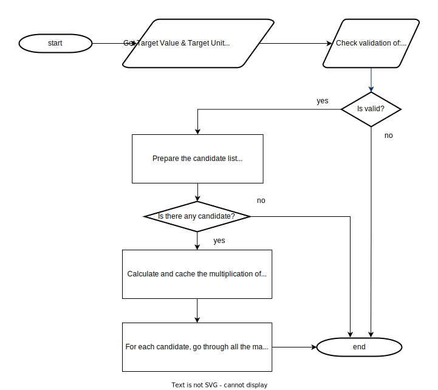

# Physics Constants Explorer

This work contains research and a python program to explore physical constants formulation in terms of given other physical and mathematical constants.

The researches and explorations by using this program can be examined under [research](research) folder.

## Table of Content


## 1 Motivation & Concept

Most of the relations in physics are observed from experiments and constants in the relations measured by instruments within the given error range.

For example Stefan-Boltzmann Constant, [Josef Stefan](https://en.wikipedia.org/wiki/Josef_Stefan) had found the relation between radiation power and temperature of the black body radiation problem:

```math
j^{\star} = \sigma T^{4}
```

where,

* $j^{\star}$ is radiated power per unit area
* $T^{4}$ is 4th power of radiated material's temperature
* $\sigma$ is a __physical constant__ (known as Stefan–Boltzmann constant)

Theoretical formulation of $\sigma$ was done by [Ludwig Eduard Boltzmann](https://en.wikipedia.org/wiki/Ludwig_Boltzmann):

```math
\sigma ={\frac {2\pi ^{5}k^{4}}{15c^{2}h^{3}}} \approxeq 5.670374\times 10^{-8}\,\mathrm{kg}\,\mathrm{s}^{-3}\,\mathrm{K}^{-4}
```

where

* $k$ is the [Boltzmann constant](https://en.wikipedia.org/wiki/Boltzmann_constant) (another physical constant)
* $h$ is the [Planck constant](https://en.wikipedia.org/wiki/Planck_constant) (another physical constant)
* $c$ is the [Speed of Light](https://en.wikipedia.org/wiki/Speed_of_light) in vacuum (physical constant)
* $\pi$ is the ratio of a circle's circumference to its diameter (mathematical constant)

with SI base units:

* kg is kilogram
* s is second
* K is Kelvin

Formulation of $\sigma$ was [theoretically derived](https://edisciplinas.usp.br/pluginfile.php/48089/course/section/16461/qsp_chapter10-plank.pdf) by using the other physical and mathematical constants.

Now, let's think oppositely and assume we have a function which takes:

* Target value: 5.670374419E-8 (in [Scientific Notation](https://en.wikipedia.org/wiki/Scientific_notation))
* Target unit: $\mathrm{kg}$⋅$\mathrm{s}^{-3}$⋅$\mathrm{K}^{-4}$
* List of physical constants with their units ( $k$, $h$, $c$, ...)
* List of mathematical constants ( $\pi$, $e$, ...)
* List of prime numbers (2, 3, 5, ...)

and returns the matched formula(s), so that:

* The target unit is "exactly" matched with the unit of formula and,
* The target value is matched with the resultant numeric value (within the given error range).

Example Output:

```text
{ 5.6703744191844... e-8 (exact) } [ kg/K⁴/s³ ] = 2⋅π⁵⋅k⁴ / (3⋅5⋅c²⋅ℎ³)
```

Would it be possible and useful?

Yes it is possible. To be honest, I am not definitely sure about its usefulness!

But I would like to start this study with the excitement of opportunity of being the first person to see the possible formulation of some famous physical constants.
And I know that this methodology can be expanded to a wider scope with distributed calculation methods if this approach can be successful and be considered as useful.

## 2 Methodology

It is a well-known fact that the resultant unit on the right side of the equations must match the left side.

```text
Quantity = {numeric value} ⋅ [unit]

Q1 = {Q1} ⋅ [Q1]
Q2 = {Q2} ⋅ [Q2]

If Q1 = Q2 then units must be equal, [Q1] = [Q2].
```
If we claim Q1 = Q2 then their numeric values should also overlap in their error ranges:
```text
Quantity = {numeric value ± error} ⋅ [unit]

Q1 = {Q1 ± ΔQ1}⋅[Q1]
Q2 = {Q2 ± ΔQ2}⋅[Q2]

To claim Q1 = Q2:
* [Q1] = [Q2], and
* {Q1 + ΔQ1} >= {Q2 - ΔQ2}, and
* {Q1 - ΔQ1} <= {Q2 + ΔQ2}
```

In the program, we can assume `Q1` is the target (`T`) and it is searching set of `Q2`'s which are the candidates satisfying the conditions given above.

The program also takes config ([default](src/resources/default_config.json)) and definition ([default](src/resources/default_definition.json)) files to restrict and define its scope.

The main steps can be summarized as:

1. Preparing the candidate list by calculating the combination of dimensional constants from the given scope such that unit of `T` equals to unit of the candidates (e.g. `[T] = [Q]`)
2. Iterating over the candidates, looking for a combination of dimensionless mathematical constants, such that the resulting multiplication places within the desired error range.
3. Printing the results by using their symbols.



I wanted to apply a simple and clear set of methodologies:

1. Brute force algorithm for all multiplication combinations
2. Using a unit library ([pint](https://pint.readthedocs.io/en/stable/)) to:
   * Represent dimensional constants units in SI base units
   * Correctly calculate and compare the units of multiplication and power operations
3. Using scientific notation with the ["concise form"](https://en.wikipedia.org/wiki/Scientific_notation#Estimated_final_digits).
4. Calculating the relative errors.
5. Using [decimal](https://docs.python.org/3/library/decimal.html) library to represent numeric values of quantities with high significant digits.
6. Using [fractions](https://docs.python.org/3/library/fractions.html) library to represent the power of the quantities and its units.

### 2.1 Technical Solutions

* Python's Decimal library was used to calculate the mathematical operations of the numeric values of the quantities.
* The "pint" library in conjunction with the Python's Fractions library was used to calculate the mathematical operations of the units part of the quantities.

The main reasons about this technical decisions are:
1. With Python Fractions library, we can achieve rational number units multiplications correctly: $s^{2/3}$ ⋅ $s^{4/3}$ ≟ $s^{2}$
2. "pint" library has support for "Non integer types" (non_int_type) to set `Decimal` or `Fractions`. But, unfortunately I could not find a feature to set numeric and unit parts class types differently.  
3. Decimal Library has nice set of features to represent numbers with high precision and operate on it quickly.

## Python Installation

The implementation is done by using Python 3.9.13. The program should run Python >=3.9.13

If python is not installed, I suggest using one of "Python Version Manager" (Anaconda, pyenv, etc.)

Please execute the following code, line by line on the projects root folder after cloning this repository.

```shell
> python -m venv ./venv
> source ./venv/bin/activate
> python -m pip install --upgrade pip
> pip install -r ./requirements.txt
```

## Running the Program

The program takes:
* The target quantity numeric value (mandatory)
* The target quantity unit (mandatory)
* The definition file (optional), that is a list of all dimensional and dimensionless constant definitions as a JSON file.
* The config file (optional), that is the scope of the program. It is a list of dimensional and dimensionless constants and their power ranges as a JSON file.

The program prints the results in descriptive format on the console.

### The Definition File

All dimensional and dimensionless constants are defined under this JSON file. The program loads and considers only the constants selected from here.

The program uses its [default definition file](src/resources/default_definition.json), if `--definition-file` parameter is not provided.
The default definition file is prepared by using [CODATA](https://physics.nist.gov/cuu/Constants/index.html) values which are the latest experimented and defined values.
If you want to add new constants or override the existing ones, please check [The Program Inputs](#the-program-inputs) section to get more info.

To make the numeric values be consistent, only SI base units are allowed as units of dimensional constants.

The definition file has 2 main collections:
* `dimensional_constants`
* `dimensionless_constants`

Each collection has its own `key`, `value` pairs, for example:
```json
{
  "dimensional_constants": {
    "speed_of_light_in_vacuum": {
      "numeric_value": "2.99792458e+8",
      "unit": "m/s",
      "symbol": "c"
    },
    ...
  },
  "dimensionless_constants": {
    "pi": {
      "numeric_value": "3.1415926535897932384626433832795028841971693993751",
      "symbol": "π"
    },
    ...
  }
}
```
#### Dimensional Constants Collection

This collection should only contain constants that have units.

It has the following key-value pair definitions:
* `key` values should contain a descriptive info (on the given example above it is `speed_of_light_in_vacuum`).
* `value` object has the following kay-value pairs:
  * `"numeric_value": "..."` (mandatory). 
    * The values should be in scientific notation format.
    * `"2.99792458e+8"`, if it is an exact value. The error will be 0 for the constants in this format.
    * `"6.67430(15)e-11"`, if it has some error. The format is a combination of both scientific and concise notations. The program considers this value as `(6.67430 ± 0.00015)✕10⁻¹¹`
  * `"unit": "..."` (mandatory). 
    * Only SI base units are accepted: m, s, mol, A, K, cd, kg
    * The following characters can be used:
      * a single space for multiplication
      * `/` for divisions
      * `^` for powers
      * `(...)` parentheses for grouping
    * The following examples which gives the same resultant unit for "Vacuum magnetic permittivity constant" :
      * `A^2 s^4/kg/m^3` = `A^2 s^4/(kg m^3)` = `A^2 s^4 kg^-1 m^-3` 
  * `"symbol": "..."` (optional). 
    * The symbol is used on the results. If it is not provided the `key` value is used on the required places.
  * `"info": "..."` (optional). 
    * If it is needed, this field can be used to enter more information.

#### Dimensionless Constants Collection

This collection should only contain constants that have no units.

It has the same key-value pairs with the same formats as the "Dimensional Constants Collection" except for `unit` definitions. It should not contain the `unit` definitions.

### The Config File

The configuration file determines which constants the program will use to find results close to the desired target value.

Within this file, the list of dimensional and dimensionless constants is defined along with their power ranges.
In this file, a list of dimensional and dimensionless constants is entered along with their power ranges.

The program uses its [default config file](src/resources/default_config.json), if `--config-file` parameter is not provided. [The Program Inputs](#the-program-inputs) section gives the info about the usage of `--config-file` parameter.

The default config file is prepared by exploring some derived physical constants. You can check the list of these derived constants under [the research document](/research).

The config file has the following parameters:
* `method`
* `dimensional_constants`
* `dimensionless_constants`

Each `constant` collection has its own `key`, `value` pairs, for example:
```json
{
  "method": "brute_force",
  "dimensional_constants": {
    "speed_of_light_in_vacuum": [-2, 6],
    "vacuum_magnetic_permeability": {"range": [0, 2], "step": "1/3"},
    ...
  },
  "dimensionless_constants": {
    "pi": 4,
    ...
  }
}
```

The `key` values (for example `speed_of_light_in_vacuum`) should match the `key` values on the provided definition file. 
Besides this, you can also provide exact custom numeric values (such as prime numbers) under `dimensionless_constants` collection without defining it under the definition file. For example:
```json
{
  ...
  "dimensionless_constants": {
    "2": 8,
    ...
  }
```

Power range values can be in 3 format as given the example above:
* List format (`[min, max]`)
  * For example `[-2, 6]`, the program converts it as integer range e.g.[-2, 1, 0, 1, 2, 3, 4, 5, 6]. It adds `0`, if `0` does not exist in the range.
* Integer format (Z). Z>0
  * The program converts it as list format `[-Z, Z]` as explained above.
* Object format (`{"range": [min, max], "step": "s"}`)
  * For the given example above, program creates the powers ranges as, [0, 1/3, 2/3, 1, 4/3, 5/3, 2]


### The Program Inputs

The program `main.py` takes target value and unit with the following input names:

* `--target-value`
* `--target-unit`
* `--config-file` (optional)
* `--definition-file` (optional)

As an example, to explore `Rydberg Constant`:

```shell
> python ./main.py --target-value "1.0973731568160(21)e+7" --target-unit "1/m"
```

Please use `--help` option to get info about the program usage & input formats:

```shell
> python ./main.py --help

options:
  -h, --help            show this help message and exit
  -v, --target-value 
                        Target value with scientific notation.
                        To specify target value with the standard uncertainty please use "concise form".
                        For example to execute (1.23±0.06)×10^−5, enter "1.23(6)E-5" or "1.230(60)E-5".
                        Some valid examples: "1.23(6)E-5", "8.9875(15)E+16", "4.20(30)E+0"
                        The target value can also be provided without uncertainty specification:
                        In this cae, the program converts "1.23E-5" to "1.230(10)E-5"
                        Some valid examples: "1.23E-5", "8.9875E+16", "4.2E+0"
  -u, --target-unit 
                        Target unit expression in terms of SI base units symbols.
                        Length - meter (m)
                        Time - second (s)
                        Amount of substance - mole (mol)
                        Electric current - ampere (A)
                        Temperature - kelvin (K)
                        Luminous intensity - candela (cd)
                        Mass - kilogram (kg)
                        Please use ^ symbol to represent power and space for multiplication.
                        Some valid examples: "kg/(s^3 K^4)", "kg s^-3 K^-4", "m/s"
  -c, --config-file 
                        The config file relative path.
                        It is a JSON file that contains the list of dimensional and dimensionless constants
                        with their power range. This file is validated by "src/resources/config_schema.json"
                        If it is not provided the program will use the default config file:
                        ./src/resources/default_config.json
  -d, --definition-file 
                        Definition file relative path.
                        It is a JSON file that contains the definition of dimensional and dimensionless constants.
                        This file is validated by "src/resources/definition_schema.json"
                        If it is not provided the program will use default definition file:
                        ./src/resources/default_definition.json
```
## The Program Outputs

The program prints the outputs to console. 

### Store Results into a File

You can store the results into a file by executing the script like:

```shell
> python ./main.py --target-value "1.0973731568160(21)e+7" --target-unit "1/m" > output_file_name.txt
```
It will store the results into `output_file_name.txt` file on the same folder that you execute the script.

### Output Format

There are 3 sections on the output. The following sections explains the parts of the `Rydberg Constant` exploration [output file.](research/output/derived_constants/rydberg_constant.txt)):

#### Summarizing the Inputs
```text
Explore the target quantity:
	{ 1.0973731568160(21) e+7 } [ 1/m ] = Target
in terms of the given:
	dimensional constants:   
		speed_of_light_in_vacuum (c) ^ [-2, -1, 0, 1, 2]
		planck_constant (ℎ) ^ [-3, -2, -1, 0, 1, 2, 3]
		boltzmann_constant (k) ^ [-4, -3, -2, -1, 0, 1, 2, 3, 4]
		elementary_charge (e) ^ [-4, -3, -2, -1, 0, 1, 2, 3, 4]
		vacuum_electric_permittivity (ε_0) ^ [-2, -1, 0, 1, 2]
		electron_mass (m_e) ^ [-2, -1, 0, 1, 2]
		avogadro_constant (N_A) ^ [-1, 0, 1]
	dimensionless constants: 
		2 ^ [-3, -2, -1, 0, 1, 2, 3]
		3 ^ [-1, 0, 1]
		5 ^ [-1, 0, 1]
		pi (π) ^ [-5, -4, -3, -2, -1, 0, 1, 2, 3, 4, 5]
		wien_u ^ [-1, 0, 1]
by using brute_force methodology...
```

#### Listing the Candidates
After checking all combination of the dimensional constants given in the scope, the program prepares the candidates list whose resultant unit matches the target unit.

```text
Found 4 candidates the resultant unit matched with the target's unit:
	{ Q } [ 1/m ] = e⁴⋅m_e / (c⋅ℎ³⋅ε_0²)
	  ├── 👍 In range!
	  └──  Min (~1E+2) < Q (~9E+7) < Max (~1E+12) 

	{ Q } [ 1/m ] = e²⋅m_e / (ℎ²⋅ε_0)
	  ├── 👍 In range!
	  └──  Min (~1E+2) < Q (~6E+9) < Max (~1E+12) 

	{ Q } [ 1/m ] = c⋅m_e / ℎ
	  ├── 👍 In range!
	  └──  Min (~1E+2) < Q (~4E+11) < Max (~1E+12) 

	{ Q } [ 1/m ] = c²⋅ε_0⋅m_e / e²
	  ├── 👎 Not in range.
	  └──  Min (~1E+2) < Max (~1E+12) < Q (~3E+13) 
```

If you look at the first candidate:
```text
...
	{ Q } [ 1/m ] = e⁴⋅m_e / (c⋅ℎ³⋅ε_0²)
	  ├── 👍 In range!
	  └──  Min (~1E+2) < Q (~9E+7) < Max (~1E+12) 
...
```

The program calculated dimensional constants multiplication and represented its numerical value as `{ Q }` and its unit as `[ 1/m ]`.

`Min` and `Max` values are calculated as:

`Min (...)` = [Target value] / [The maximum value of the dimensionless multiplication combinations]

`Max (...)` = [Target value] / [The minimum value of the dimensionless multiplication combinations]

So, the line:

`	  └──  Min (~1E+2) < Q (~9E+7) < Max (~1E+12) `:

represents: `Q` is in the range of dimensionless multiplication range. If it is not in range, this candidate will be ignored and its numerical value will not be investigated on the next steps.

This distinction is highlighted as `👍 In range!` or `👎 Not in range.`.

#### Matched Results

At this step the program calculates all dimensionless multiplication combinations given in the scope.
```text
Totally, unique 2079 dimensionless multiplications are calculated!
```
If we multiply the length of mathematical constants powers:
`2079 = 11 x 3 x 7 x 3 x 3` combination count can be verified.

At the end, the program lists numerically matched results from the candidate list:

```text
Result(s) that overlap with the target:
	{ 1.0973731568160(21) e+7 } [ 1/m ] = Target
	{ 1.09737315681(66) e+7 } [ 1/m ] = e⁴⋅m_e / (2³⋅c⋅ℎ³⋅ε_0²)
```

## Tests

Test folder is [src/tests](src/tests). To run the all test:

```shell
> pytest
```

## Researches

Some well-known physical constant values were explored and verified by using this program.

Unknown physical constants like Newtonian Constant of Gravitation (G) were also explored under the same [./research](./research) folder.

## Resources

### Libraries & Documentation

* [pint](https://pint.readthedocs.io/en/stable/)
  * [pint repository](https://github.com/hgrecco/pint/tree/master/pint)
  * [pint developer reference](https://pint.readthedocs.io/en/stable/developers_reference.html)
  * [pint tutorıal](https://pint.readthedocs.io/en/stable/tutorial.html)
  * [pint default constants definition file](https://github.com/hgrecco/pint/blob/master/pint/constants_en.txt)
* [Python fractions](https://docs.python.org/3/library/fractions.html)
  * It is used on the mathematical operations of the unit part of the quantities
* [Python decimal](https://docs.python.org/3/library/decimal.html)
  * It is used on the mathematical operations of the numeric value of the quantities
* [jsonschema](https://python-jsonschema.readthedocs.io/en/stable/) 
  * It is used to validate the JSON files.
* [Latex Mathematics](https://en.wikibooks.org/wiki/LaTeX/Mathematics)
  * [Writing mathematical expressions](https://docs.github.com/en/get-started/writing-on-github/working-with-advanced-formatting/writing-mathematical-expressions)


## Future Work

* Explore possibility of finding all (known) physical constants with a single config file? Targeting `1.0000` with `dimensionless` methodology can be usefully for this purpose, like:

```shell
> python ./main.py --target-value "1.00000E+0" --target-unit ""
```

* Implement caching
* Store results into the output file. Currently, results are printed to the console.
* Use python [logging](https://docs.python.org/3/howto/logging.html) instead of `print` after implementing the output file.


## Behind the Scene

I am a computer engineer with a background in Scientific Computing and Physics. 
Last 4 years I am mainly working in big data related subjects and domains.  

When I was in high school, I was selected to the Physics Olympic team of my home country. I was 2. on our team and won the honourable mention award in [IPhO 1996 (XXVII Oslo, Norway)](https://www.ipho-new.org/documentations/#statistics).

In the same year, I won the Computer Engineering department in my country's university exam and I decided to study computer engineering.

When I look back now, I was very happy to see that my physics knowledge was still not erased and that I could remember some of them with a short effort.

To be honest, we talked about the feasibility of this program 20 years ago, in a conversation with my close friend Atilim Cetin. In those years, there weren't libraries like the [pint](https://pint.readthedocs.io/en/stable/) quantity library which helps to deal with units parts of the quantities. 

I would like to thank all the team who have developed the pint library 👏!

I don't know if a similar physical constant explorer program has been already implemented before. 
If it has been done already, I hope this approach gives a new perspective on helping us to understand the mystery of nature with good purposes!

## Acknowledgement & Gratitude

I would like to express my gratitude to my physics teachers who made me love physics and prepared us for the physics olympiads:

* Physics Teacher Rafet Kamer, Physics Olympiads
* Prof. Dr. K. Sinan Bilikmen, METU-Physics
* Prof. Dr. Mehmet Tomak, METU-Physics

And who are not with us:

* Prof. Dr. İbrahim Günal (R.I.P), METU-Physics
* Prof. Dr. Ordal Demokan (R.I.P), METU-Physics
* Physics Teacher Aykut Gümüç (R.I.P), Eskisehir Science High School
* Prof. Dr. Oleg Fedorovich Kabardin (R.I.P), Physics Olympiads

And I would like to thanks to my genius and big-hearted friends who always enjoy supporting me:

* Dr. İnanç Kanık
* Dr. Özgür Sümer
* Atılım Çetin
* Osman Özgür
* Ali Onur Geven

And of course to my beloved wife Ayşen and my dear children Ozan & Doruk!

I would like to thank again all the team who developed the pint library!

Emre Dagli
