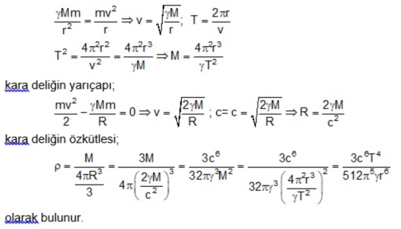

# Researches

This work contains exploration of some well-known physical constants and experiments for some unknown constants by using the `physics-constant-explorer` program explained on the [root folder](..).

## Table of Content

<!-- TOC -->
* [1 Exploring Derived Physical Constants](#1-exploring-derived-physical-constants)
* [2 Exploring Planck Units](#2-exploring-planck-units)
* [3 Exploring Some Physics Problem](#3-exploring-some-physics-problem)
  * [3.1 Black Hole Density](#31-black-hole-density)
* [4 Experiments](#4-experiments)
  * [4.1 Magnetic Constant to Electric Constant Ratio](#41-magnetic-constant-to-electric-constant-ratio)
    * [4.1.1 Introduction](#411-introduction)
      * [4.1.1.1 Speed of Light in Vacuum (1)](#4111-speed-of-light-in-vacuum--1-)
      * [4.1.1.2 Fine-structure Constant (2)](#4112-fine-structure-constant--2-)
      * [4.1.1.3 Rydberg Constant (3)](#4113-rydberg-constant--3-)
    * [4.1.2 Results](#412-results)
  * [4.2 Newtonian Constant of Gravitation](#42-newtonian-constant-of-gravitation)
    * [4.2.1 Newtonian Constant of Gravitation - Attempt 01](#421-newtonian-constant-of-gravitation---attempt-01)
      * [4.2.1.1 Resources](#4211-resources)
      * [4.2.1.2 Results](#4212-results)
    * [4.2.2 Newtonian Constant of Gravitation - Attempt 02](#422-newtonian-constant-of-gravitation---attempt-02)
      * [4.2.2.1 Resources](#4221-resources)
      * [4.2.2.2 Introduction](#4222-introduction)
      * [4.2.2.3 Results](#4223-results)
    * [4.2.3 Newtonian Constant of Gravitation - Attempt 03](#423-newtonian-constant-of-gravitation---attempt-03)
      * [4.2.3.1 Resources](#4231-resources)
      * [4.2.3.2 Introduction](#4232-introduction)
      * [4.2.3.3 Results](#4233-results)
* [5 Resources](#5-resources)
  * [5.1 Physical Constants](#51-physical-constants)
* [6 Final Notes](#6-final-notes)
<!-- TOC -->

## 1 Exploring Derived Physical Constants

The script ([derived_constants.sh](script/derived_constants.sh)) is prepared to explore some constants that can be derived using fundamental constants.

The following script was executed on the project root folder, and it stored the results given on the table below:
```shell
> research/script/derived_constants.sh
```

* The default config file ([default_config.json](../src/resources/default_config.json)) was used on all calculations!
* The default definition file ([default_definition.json](../src/resources/default_definition.json)) was used.
* CODATA values were used as target numeric values.

| Constant | Constant Expression | Numeric Value | Unit | The Result | Output File |
| -------- | ------------------- | ------------- | ---- | ---------- | ----------- |
| [Stefan–Boltzmann Constant](https://en.wikipedia.org/wiki/Stefan%E2%80%93Boltzmann_constant) | $\sigma ={\frac {2\pi ^{5}k^{4}}{15c^{2}h^{3}}}$ | [5.670374419E-8](https://physics.nist.gov/cgi-bin/cuu/Value?sigma) | kg/K⁴/s³ | 2⋅π⁵⋅k⁴ / (3⋅5⋅c²⋅ℎ³) | [stefan_boltzmann_constant.txt](output/derived_constants/stefan_boltzmann_constant.txt) |
| [Rydberg Constant](https://en.wikipedia.org/wiki/Rydberg_constant) | $R_{\infty }={\frac {m_{\text{e}}e^{4}}{8\varepsilon _{0}^{2}h^{3}c}}$ | [1.0973731568160(21)e+7](https://physics.nist.gov/cgi-bin/cuu/Value?ryd) | 1/m | e⁴⋅m_e / (2³⋅c⋅ℎ³⋅ε_0²) | [rydberg_constant.txt](output/derived_constants/rydberg_constant.txt) |
| [Fine Structure Constant](https://en.wikipedia.org/wiki/Fine-structure_constant) | $\alpha ={\frac {e^{2}}{2\varepsilon _{0}hc}}$ | [7.2973525693(11)E-3](https://physics.nist.gov/cgi-bin/cuu/Value?alph) | [ dimensionless ] | e² / (2⋅c⋅ℎ⋅ε_0) | [fine_structure_constant.txt](output/derived_constants/fine_structure_constant.txt) |
| [Molar Gas Constant](https://en.wikipedia.org/wiki/Gas_constant) | $R=N_{\rm {A}}k_{\rm {B}}$ | [8.314462618E0](https://physics.nist.gov/cgi-bin/cuu/Value?r) | kg·m²/K/mol/s² | k⋅N_A | [molar_gas_constant.txt](output/derived_constants/molar_gas_constant.txt) |
| [Vacuum Permeability (Magnetic Constant)](https://en.wikipedia.org/wiki/Vacuum_permeability) | $\mu _{0}={1 \over {c^{2}\varepsilon _{0}}}$ | [1.25663706212(19)e-6](https://physics.nist.gov/cgi-bin/cuu/Value?mu0) | kg·m/A²/s² | 1 / (c²⋅ε_0) | [vacuum_magnetic_permeability.txt](output/derived_constants/vacuum_magnetic_permeability.txt) |
| [Wien Frequency Displacement Law Constant](https://en.wikipedia.org/wiki/Wien%27s_displacement_law#Frequency-dependent_formulation) | $\nu _{\text{peak}}={\alpha  \over h}kT$ | [5.878925757E+10](https://physics.nist.gov/cgi-bin/cuu/Value?bpwien) | 1/K/s | wien_u⋅k / ℎ | [wien_frequency_displacement_law_constant.txt](output/derived_constants/wien_frequency_displacement_law_constant.txt) |
| [Impedance of Free Space](https://en.wikipedia.org/wiki/Impedance_of_free_space#Relation_to_other_constants) | $Z_{0}={\frac {1}{\varepsilon _{0}c}}$ | [3.76730313668(57)E+2](https://physics.nist.gov/cgi-bin/cuu/Value?z0) | kg·m²/A²/s³ | 1 / (c⋅ε_0) | [impedance_of_free_space.txt](output/derived_constants/impedance_of_free_space.txt) |
| [Josephson Constant](https://en.wikipedia.org/wiki/Magnetic_flux_quantum) | $1 / \Phi _{B}={\frac {2e}{h}}$ | [4.835978484E+14](https://physics.nist.gov/cgi-bin/cuu/Value?kjos) | A·s²/kg/m² | 2⋅e / ℎ | [josephson_constant.txt](output/derived_constants/josephson_constant.txt) |
| [Von Klitzing Constant](https://en.wikipedia.org/wiki/Quantum_Hall_effect#Applications) | $\R _{K}={\frac {h}{e^{2}}}$ | [2.581280745E+4](https://physics.nist.gov/cgi-bin/cuu/Value?rk) | kg·m²/A²/s³ | ℎ / e² | [von_klitzing_constant.txt](output/derived_constants/von_klitzing_constant.txt) |

## 2 Exploring Planck Units

"Planck considered only the units based on the universal constants $\displaystyle G$, $\displaystyle h$, 
$\displaystyle c$, and $\displaystyle k_{\rm B}$ to arrive at natural units for length, time, mass, and temperature.
His definitions differ from the modern ones by a factor of $\displaystyle {\sqrt {2\pi }}$, 
because the modern definitions use $\displaystyle \hbar$  rather than $\displaystyle h$."
([Planck units - Wikipedia](https://en.wikipedia.org/wiki/Planck_units#History_and_definition))

The script ([planck_units.sh](script/planck_units.sh)) is prepared to explore the Planck Units.

The following script was executed on the project root folder, and it stored the results given on the table below:
```shell
> research/script/planck_units.sh
```

* The config file ([planck_units.json](config/planck_units/plank_units.json)) is used on the calculations.
* The default definition file ([default_definition.json](../src/resources/default_definition.json)) is used.
* Again, CODATA values were picked as target numeric values.


| Constant | Constant Expression | Numeric Value | Unit | The Result | Output File |
| -------- | ------------------- | ------------- | ---- | ---------- | ----------- |
| [Planck Length](https://en.wikipedia.org/wiki/Planck_units#History_and_definition) | $l_{\text{P}}={\sqrt {\frac {\hbar G}{c^{3}}}}$ | [1.616255(18)E-35](https://physics.nist.gov/cgi-bin/cuu/Value?plkl) | m | ℎ¹ᐟ²⋅G¹ᐟ² / (2¹ᐟ²⋅π¹ᐟ²⋅c³ᐟ²) | [planck_length.txt](output/planck_units/planck_length.txt) |
| [Planck Mass](https://en.wikipedia.org/wiki/Planck_units#History_and_definition) | $m_{\text{P}}={\sqrt {\frac {\hbar c}{G}}}$ | [2.176434(24)E-8](https://physics.nist.gov/cgi-bin/cuu/Value?plkm) | kg | c¹ᐟ²⋅ℎ¹ᐟ² / (2¹ᐟ²⋅π¹ᐟ²⋅G¹ᐟ²) | [planck_mass.txt](output/planck_units/planck_mass.txt) |
| [Planck Time](https://en.wikipedia.org/wiki/Planck_units#History_and_definition) | ${\displaystyle t_{\text{P}}={\sqrt {\frac {\hbar G}{c^{5}}}}}$ | [5.391247(60)E-44](https://physics.nist.gov/cgi-bin/cuu/Value?plkt) | s | ℎ¹ᐟ²⋅G¹ᐟ² / (2¹ᐟ²⋅π¹ᐟ²⋅c⁵ᐟ²) | [planck_time.txt](output/planck_units/planck_time.txt) |
| [Planck Temperature](https://en.wikipedia.org/wiki/Planck_units#History_and_definition) | ${\displaystyle T_{\text{P}}={\sqrt {\frac {\hbar c^{5}}{Gk_{\text{B}}^{2}}}}}$ | [1.416784(16)E+32](https://physics.nist.gov/cgi-bin/cuu/Value?plktmp) | K | c⁵ᐟ²⋅ℎ¹ᐟ² / (2¹ᐟ²⋅π¹ᐟ²⋅G¹ᐟ²⋅k) | [planck_temperature.txt](output/planck_units/planck_temperature.txt) |


## 3 Exploring Some Physics Problem

### 3.1 Black Hole Density

We wanted to challenge this program with more ambitious theoretical constant. 
Therefore, one of the theoretical inference of the density of the black hole has been explored as well.

Suppose a star rotates around a black hole with a $T$ orbital period on a circular orbit with a radius of $r$.

So, $\rho$ could be derived in terms of $T$ and $r$:



Where:
* $\gamma$: Newtonian constant of gravitation
* M: the mass of the black hole
* m: the mass of the star
* v: the numeric value of the velocity of the star
* R: the radius of the blackhole

If the target numeric value is selected as `3⋅c⁶ / (512⋅π⁵⋅G) = 2.0826698222(1)E+56` and unit as `kg·m³/s⁴`:

The program calculated the constant ([the script file](script/physics_problems.sh)) as we expected ([output file](output/physics_problems/black_hole_density.txt)):

```text
Result(s) that overlap with the target:
	{ 2.08266982220(10) e+56 } [ kg·m³/s⁴ ] = Target
	{ 2.082670(47) e+56 } [ kg·m³/s⁴ ] = 3⋅c⁶ / (2⁹⋅π⁵⋅G)
```

Note: as you see "G" the newtonian constant of gravitation increased the resultant expression uncertainty!

## 4 Experiments

After executing enough runs on the other physical constants, it is time to experiment on measured but not theoretically-proofed constants.

The script "[experiments.sh](script/experiments.sh)" is used on the experiments listed on this section.

Note: Please execute the script on the project's root folder, if you want to test it:

```shell
> ./research/script/experiments.sh
```

### 4.1 Magnetic Constant to Electric Constant Ratio

#### 4.1.1 Resources

Resources used for this experiment:

* [Config File - magnetic_constant_to_electric_constant_ratio.json](config/experiments/magnetic_constant_to_electric_constant_ratio.json)
* [Default Definition File - default_definition.json](../src/resources/default_definition.json)
* [Output File - magnetic_constant_to_electric_constant_ratio.txt](output/experiments/magnetic_constant_to_electric_constant_ratio.txt)
* [Script File - experiments.sh](script/experiments.sh)

#### 4.1.2 Introduction

Vacuum Magnetic Permeability (Magnetic Constant):

* [CODATA value](https://physics.nist.gov/cgi-bin/cuu/Value?mu0): $\mu _{0}=1.25663706212(19) \times 10^{-6} \, \mathrm{kg} \, \mathrm{m} \, \mathrm{A}^{-2} \, \mathrm{s}^{-2}$
* [More information](https://en.wikipedia.org/wiki/Vacuum_permeability) on Wikipedia.

Vacuum Electric Permittivity (Electric Constant):

* [CODATA value](https://physics.nist.gov/cgi-bin/cuu/Value?ep0): $\varepsilon _{0}=8.8541878128(13) \times 10^{-12} \,\mathrm{A^{2}}\,\mathrm{s}^{4}\,\mathrm{kg}^{-1}\,\mathrm{m}^{-3}$
* [More information](https://en.wikipedia.org/wiki/Vacuum_permittivity) on Wikipedia.

There is only one proven relationship between the 3 fundamental physical constants listed below:

* $\mu _{0}$ (magnetic constant)
* $\varepsilon _{0}$ (electric Constant)
* $c$ (speed of light)

Which is:

```math
c={\frac {1}{\sqrt {\varepsilon _{0}\mu _{0}}}}
```

So, actually we do not have an independent derivation for $\mu _{0}$, $\varepsilon _{0}$ or $\mu _{0} / \varepsilon _{0}$ ratio itself.

The target of this experiment is exploring the ratio of $\mu _{0} / \varepsilon _{0}$.

We are also expecting the following well-known relations that contain $\varepsilon _{0}$ and $\mu _{0}$ in the results.

##### 4.1.2.1 Speed of Light in Vacuum (1)

c (speed of light in vacuum) contains $\varepsilon _{0}$ and $\mu _{0}$:

```math
c={\frac {1}{\sqrt {\varepsilon _{0}\mu _{0}}}}
```

##### 4.1.2.2 Fine-structure Constant (2)

$\alpha$ (fine-structure constant) contains $e$ (elementary charge), $h$ (plank constant), $\varepsilon _{0}$:

```math
\alpha={\frac {e^{2}}{2\varepsilon _{0}hc}}={\frac {e^{2}}{2h}}{\sqrt{\frac {\mu _{0}}{\varepsilon _{0}}}}
```

##### 4.1.2.3 Rydberg Constant (3)

$R_{\infty }$ (Rydberg constant) contains $e$, $m_{\text{e}}$ (the rest mass of the electron), $h$ and $c$:

```math
R_{\infty }={\frac {m_{\text{e}}e^{4}}{8\varepsilon _{0}^{2}h^{3}c}}={\frac {m_{\text{e}}e^{4}c}{8h^{3}}}{\frac {\mu _{0}}{\varepsilon _{0}}}
```

#### 4.1.3 Results

The target value ($\mu _{0}/\varepsilon _{0}$ ratio) is:

```math
{\frac {\mu _{0}}{\varepsilon _{0}}}=1.4192572923(42) \times 10^{5} \, \mathrm{kg}^{2} \, \mathrm{m}^{4} \, \mathrm{A}^{-4} \, \mathrm{s}^{-6}
```

The error of the target is calculated based on the relative errors.

```text
Found 3 candidates the resultant unit matched with the target's unit:
	{ Q } [ kg²·m⁴/A⁴/s⁶ ] = R_inf¹ᐟ²⋅ℎ⁵ᐟ² / (e⁴⋅m_e¹ᐟ²⋅c¹ᐟ²)
	  ├── 👍 In range!
	  └── Min (~3E-7) < Q (~3E+6) < Max (~8E+16)

	{ Q } [ kg²·m⁴/A⁴/s⁶ ] = ℎ² / e⁴
	  ├── 👍 In range!
	  └── Min (~3E-7) < Q (~7E+8) < Max (~8E+16)

	{ Q } [ kg²·m⁴/A⁴/s⁶ ] = ℎ³ᐟ²⋅m_e¹ᐟ²⋅c¹ᐟ² / (e⁴⋅R_inf¹ᐟ²)
	  ├── 👍 In range!
	  └── Min (~3E-7) < Q (~1E+11) < Max (~8E+16)
```

And 3 of these numerically matched the target value:

```text
Result(s) that overlap with the target:
	{ 1.4192572923(42) e+5 } [ kg²·m⁴/A⁴/s⁶ ] = Target
R1	{ 1.41925729237(43) e+5 } [ kg²·m⁴/A⁴/s⁶ ] = 2⁵ᐟ²⋅α⋅R_inf¹ᐟ²⋅ℎ⁵ᐟ² / (e⁴⋅m_e¹ᐟ²⋅c¹ᐟ²)
R2	{ 1.41925729236(43) e+5 } [ kg²·m⁴/A⁴/s⁶ ] = 2²⋅α²⋅ℎ² / e⁴
R3	{ 1.41925729236(86) e+5 } [ kg²·m⁴/A⁴/s⁶ ] = 2³ᐟ²⋅α³⋅ℎ³ᐟ²⋅m_e¹ᐟ²⋅c¹ᐟ² / (e⁴⋅R_inf¹ᐟ²)
```

As it was expected,

* The result (R2) is actually the same equation of $\alpha$ [(2) fine-structure constant](#4122-fine-structure-constant-2)
* The results (R1) and (R3) can be derived from the equation $R_{\infty }$ [(3) Rydberg Constant](#4123-rydberg-constant-3), (2) and c [(1) speed of light](#4121-speed-of-light-in-vacuum-1).

With this experiment, these 3 equations were found as we have expected.
But a possible alternative expressions for $\mu _{0}/\varepsilon _{0}$ ratio for the given exploration scope could not be found.

### 4.2 Newtonian Constant of Gravitation

According to Newton's law of universal gravitation, the attractive force (F) between two point-like bodies is
directly proportional to the product of their masses (m1 and m2) and inversely proportional to the square of the distance,
r, between their centers of mass (Ref: [Gravitational constant - Wikipedia](https://en.wikipedia.org/wiki/Gravitational_constant)):

```math
F=G{\frac {m_{1}m_{2}}{r^{2}}}
```

Again, [CODATA](https://physics.nist.gov/cgi-bin/cuu/Value?bg) value of the newtonian gravitational constant
was used on the following calculations.

#### 4.2.1 Newtonian Constant of Gravitation - Attempt 01

In the first attempt, as a scope, the default config file was used. The same scope was also used on the "Exploring Derived Physical Constants" [section above](#exploring-derived-physical-constants).

##### 4.2.1.1 Resources

Resources used for this experiment:

* [Default Config File - magnetic_constant_to_electric_constant_ratio.json](../src/resources/default_config.json)
* [Default Definition File - default_definition.json](../src/resources/default_definition.json)
* [Output File - newtonian_constant_of_gravitation_attempt_01.txt](output/experiments/newtonian_constant_of_gravitation_attempt_01.txt)
* [Script File - experiments.sh](script/experiments.sh)


##### 4.2.1.2 Results

The program found 4 candidates that the resultant unit matched with the target's unit:

```text
	{ Q } [ m³/kg/s² ] = e⁴ / (c⋅ℎ⋅ε_0²⋅m_e²)
	  ├── 👎 Not in range.
	  └── Min (~6E-16) < Max (~7E-6) < Q (~5E+31)

	{ Q } [ m³/kg/s² ] = e² / (ε_0⋅m_e²)
	  ├── 👎 Not in range.
	  └── Min (~6E-16) < Max (~7E-6) < Q (~3E+33)

	{ Q } [ m³/kg/s² ] = c⋅ℎ / m_e²
	  ├── 👎 Not in range.
	  └── Min (~6E-16) < Max (~7E-6) < Q (~2E+35)

	{ Q } [ m³/kg/s² ] = c²⋅ℎ²⋅ε_0 / (e²⋅m_e²)
	  ├── 👎 Not in range.
	  └── Min (~6E-16) < Max (~7E-6) < Q (~2E+37)
```

Unfortunately, there are no candidates in the dimensionless range for the experimented scope ([default_config.json](../src/resources/default_config.json)).

To place the "Q" numeric value in the range, it is needed to add a big dimensionless constant(s) into our dimensionless constants or needed to change the whole scope.

One of the [Dirac's large number](https://en.wikipedia.org/wiki/Dirac_large_numbers_hypothesis) which is the ratio of the electrical to the gravitational forces between a proton and an electron:

```math
{\frac {e^{2}}{4\pi \epsilon _{0}Gm_{\text{p}}m_{\text{e}}}}\approx 10^{40}
```

It was also tried, but no satisfactory result was found!

#### 4.2.2 Newtonian Constant of Gravitation - Attempt 02

##### 4.2.2.1 Resources
Resources used for this experiment:

* [Config file - newtonian_constant_of_gravitation_attempt_02.json](config/experiments/newtonian_constant_of_gravitation_attempt_02.json)
* [Default Definition File - default_definition.json](../src/resources/default_definition.json)
* [Output file - newtonian_constant_of_gravitation_attempt_02.txt](output/experiments/newtonian_constant_of_gravitation_attempt_02.txt)
* [Script file - experiments.sh](script/experiments.sh)

##### 4.2.2.2 Introduction

In this case, $\mu _{0}/\varepsilon _{0}$ ratio is added into the definition file.

And used in the config file.

##### 4.2.2.3 Results

The program found 6 candidates that the resultant unit matched with the target's unit and __the resultant value in the dimensionless range__.

And found 3 candidates that their numeric value overlap with the target range:
```text
Result(s) that overlap with the target:
	{ 6.67430(15) e-11 } [ m³/kg/s² ] = Target
R1	{ 6.674224928(14) e-11 } [ m³/kg/s² ] = α²⋅c⋅mc_to_ec_ratio²⋅e⁸ / (3⋅5³⋅π⁴⋅μ⁹⋅ℎ³⋅m_e²)
R2	{ 6.674224928(14) e-11 } [ m³/kg/s² ] = 2⋅α³⋅c⋅mc_to_ec_ratio³ᐟ²⋅e⁶ / (3⋅5³⋅π⁴⋅μ⁹⋅ℎ²⋅m_e²)
R3	{ 6.674224928(14) e-11 } [ m³/kg/s² ] = 2²⋅α⁴⋅c⋅mc_to_ec_ratio⋅e⁴ / (3⋅5³⋅π⁴⋅μ⁹⋅ℎ⋅m_e²)
```

The program actually found a single candidate, not 3 different one. 
if we put $\alpha$ (the fine-structure constant) formulation on the results they are equal.

If we write for example (R3) with well-known symbols of the constants:

```math
6.674224928(14)E-11 m³/kg/s² \approx {\frac {2^{2}}{3\cdot5^{3}\cdot\pi^{4}}}\cdot{\frac {\alpha^{4} \,e^{4} \,c\,\mu _{0}}{h\,\varepsilon _{0}}\cdot{\frac {\\m _{e}^{7}}{\\m _{p}^{9}}}}
```

* $\alpha$ is the fine-structure constant
* $h$ is the planck constant
* $c$ is the speed of light in vacuum
* $e$ is the elementary charge
* $\m _{e}$ is the mass of a stationary electron
* $\m_{e}$ is the mass of a stationary electron
* $\\m_{e}$ is the mass of a stationary electron
* the mass of a stationary electron is $\\m _{e}$ 
* <pre xml:lang="latex">\m _{e}</pre>
* <pre xml:lang="latex">\\m _{e}</pre>
* $\m _{p}$ is the mass of proton
* $\mu _{0}$ is the vacuum permeability (magnetic constant)
* $\varepsilon _{0}$ is the vacuum permittivity (electric constant)
* $\pi$ is the ratio of a circle's circumference to its diameter (mathematical constant)

This expression can be re-formed in various ways. So on the next attempt, `the fine-structure constant` will be removed from the dimensionless constants scope.

And it is also important that, if we increase the dimensionless constants scope, especially having less significant digit targets (such as here, because it has 6 significant digits) we may get different results.


#### 4.2.3 Newtonian Constant of Gravitation - Attempt 03

##### 4.2.3.1 Resources

Resources used for this experiment:

* [Config file - newtonian_constant_of_gravitation_attempt_03.json](config/experiments/newtonian_constant_of_gravitation_attempt_03.json)
* [Default Definition File - default_definition.json](../src/resources/default_definition.json)
* [Output file - newtonian_constant_of_gravitation_attempt_03.txt](output/experiments/newtonian_constant_of_gravitation_attempt_03.txt)
* [Script file - experiments.sh](script/experiments.sh)

##### 4.2.3.2 Introduction

In this attempt:
* instead of using $\mu _{0}/\varepsilon _{0}$ ratio, $\mu _{0}$ and $\varepsilon _{0}$ constants are used
* The fine-structure constant is removed from the dimensionless constants scope
* More dense power ranges are added around the target that we have found on previous attempt, such that:
  * `"planck_constant": 8` changed as `"planck_constant": {"range": [-6,-4], "step": "1/6"},`
  * `"elementary_charge": 8,` changed as `"elementary_charge": {"range": [11, 13], "step": "1/6"},`
* To speed up the calculations new methodology is implemented `brute_force_with_memorization`

##### 4.2.3.3 Results

The program found 7 candidates that the resultant unit matched with the target's unit and __the resultant value in the mathematical range__.

```text
Found 7 candidates the resultant unit matched with the target's unit:
	{ Q } [ m³/kg/s² ] = c¹⁵ᐟ²⋅µ_0¹³ᐟ²⋅e¹³ / (ℎ¹¹ᐟ²⋅m_e²)
	{ Q } [ m³/kg/s² ] = c²²ᐟ³⋅µ_0¹⁹ᐟ³⋅e³⁸ᐟ³ / (ℎ¹⁶ᐟ³⋅m_e²)
	{ Q } [ m³/kg/s² ] = c⁴³ᐟ⁶⋅µ_0³⁷ᐟ⁶⋅e³⁷ᐟ³ / (ℎ³¹ᐟ⁶⋅m_e²)
	{ Q } [ m³/kg/s² ] = c⁷⋅µ_0⁶⋅e¹² / (ℎ⁵⋅m_e²)
	{ Q } [ m³/kg/s² ] = c⁴¹ᐟ⁶⋅µ_0³⁵ᐟ⁶⋅e³⁵ᐟ³ / (ℎ²⁹ᐟ⁶⋅m_e²)
	{ Q } [ m³/kg/s² ] = c²⁰ᐟ³⋅µ_0¹⁷ᐟ³⋅e³⁴ᐟ³ / (ℎ¹⁴ᐟ³⋅m_e²)
	{ Q } [ m³/kg/s² ] = c¹³ᐟ²⋅µ_0¹¹ᐟ²⋅e¹¹ / (ℎ⁹ᐟ²⋅m_e²)
```

And found 3 candidates that their numeric values overlap with the target range:
```text
Totally, unique 128282 dimensionless multiplications are calculated!
Result(s) that overlap with the target:
	{ 6.67430(15) e-11 } [ m³/kg/s² ] = Target
R1	{ 6.674314482(14) e-11 } [ m³/kg/s² ] = 5²⋅c²²ᐟ³⋅µ_0¹⁹ᐟ³⋅e³⁸ᐟ³ / (2⁶⋅3⋅π³⋅μ²⁹ᐟ³⋅ℎ¹⁶ᐟ³⋅m_e²)
R2	{ 6.674224928(14) e-11 } [ m³/kg/s² ] = c⁷⋅µ_0⁶⋅e¹² / (2²⋅3⋅5³⋅π⁴⋅μ⁹⋅ℎ⁵⋅m_e²)
R3	{ 6.674365007(14) e-11 } [ m³/kg/s² ] = c²⁰ᐟ³⋅µ_0¹⁷ᐟ³⋅e³⁴ᐟ³ / (2⋅3²⋅5²⋅π³⋅μ¹⁹ᐟ²⋅ℎ¹⁴ᐟ³⋅m_e²)
```

R2 is the result that we have found the previous attempt.

If we would have measured the numerical value of G more precisely, maybe we would have been able to eliminate some of these results.

At this point, I think that it does not make much sense to make explorations using the program for the Newtonian Constant of Gravitation (G), which has only 6 significant digits.

## 5 Resources

### 5.1 Physical Constants

* [The NIST Reference on Constants, Units, and Uncertainty (CODATA 2018 values)](https://physics.nist.gov/cuu/Constants/index.html)
* [NIST, Fundamental Physical Constants — Extensive Listing](https://physics.nist.gov/cuu/pdf/all.pdf)

## 6 Final Notes

The results found in this research are only some numerical explorations, they are not physical proof or a derivation!

I hope the approach and the results, make sense to physicists and would be beneficial in their research!

